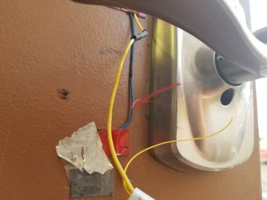

# Arduino Code for Quelab RFID reader
This project is intended to replace the code that was originally running on the RFID door control system for Quelab.


The program just runs in a loop doing the following:
* Listen for input from the USB serial port connected to a PC
* Read events from RFID reader
* Process sensor Input from Door Lock, Door Open
* Handle periodic Timer events to either relock the door, or send Status of Health

Previously there was hardware connected to control an Open Sign, but this will most likely not be used in the current implementation to simply wiring connections.

## Build/Deploy
The most automated way to build/deploy to an arduino nano is using docker. The easiest is likely with Arduino UI.

## Docker under Linux
Just connect the arduino devices USB (assuming /dev/ttyUSB0) port to your computer and issue the following
commands:

```bash
docker build -t quelab-rfid-arduino .
docker run -it --rm --device=/dev/ttyUSB0 -v $(pwd):/sketch quelab-rfid-arduino upload
```

Other Commands available:
* bash
* build
* monitor (uses gnu screen exit with 'Ctrl-a \')
* upload

# Implementation Details
## Hardware

* [Schlage Electronic Lock](https://www.amazon.com/dp/B001GPL5WU/ref=asc_df_B001CO9RJS5183835/?tag=hyprod-20&creative=394997&creativeASIN=B001CO9RJS&linkCode=df0&hvadid=167141158985&hvpos=1o4&hvnetw=g&hvrand=1431498778769732014&hvpone=&hvptwo=&hvqmt=&hvdev=c&hvdvcmdl=&hvlocint=&hvlocphy=9030452&hvtargid=pla-275433015017&th=1)
* [Arduino Nano](https://store.arduino.cc/usa/arduino-nano)
* [RDM6300](https://www.itead.cc/wiki/RDM6300)
    - clock drift is pretty severe on the device I bought. I have to restart the device once a day to be able to effectively read cards again.

  

## Protocol Data Link Layer
The data link layer uses a simplified ISO [High-level Data Link Control](https://en.wikipedia.org/wiki/High-Level_Data_Link_Control).

| Flag  | Information                 | FCS          | Flag |
|-------|-----------------------------|--------------|------|
|8 bits | Variable length, n * 8 bits | 16 bits      |8 bits|
| ~     | [payload]                   |[xmodem crc16]| ~    |

All serial communication is processed a single byte at a time. This allows the Arduino to do other processing without getting bogged down handing serial communications. It uses a pretty standard Frame start/end flag 0x7e *~*. The HDLC used here is somewhat non standard because it lacks some features like address (unnecessary for peer communications) and Control.

The HDLC implementation is taken from a library found online and modified to use xmodem crc in place of the PPP CRC16. This is mostly because xmodem CRC seems to be better supported.

* [HDLC library](https://github.com/jarkko-hautakorpi/Arduhdlc) &rarr; [modified HDLC library](https://github.com/kak-bo-che/Arduhdlc) (my fork to use xmodem crc instead of PPP)
* [CRC FAQ](http://www.ross.net/crc/download/crc_v3.txt)

## Protocol Application Layer
The application layer protocol is simply [JSON](www.json.org). JSON is probably an unexpected choice for arduino communications because it is super verbose and would be a waste of memory for complicated applications. I attempted to use Google's [MessagePack](http://msgpack.org/index.html) initially, but couldn't find a library that played nicely with the HLDC used for communications. One advantage of JSON though is it is widely supported in all programming languages w/o add on libraries and it is human readable. In the future it may be necessary to increase the [ArduinoJSON buffer](https://bblanchon.github.io/ArduinoJson/assistant/) if larger messages are necessary.
JSON makes it easy to write a PC application that communicate with the Arduino.

### Example Communications:

#### Status of Health Message (Arduino &rarr; PC)
```json
{"message":"status","door_open":true,"locked":true,"lock_open":false}
```
#### RFID Read Message (Arduino &rarr; PC)
```json
{"message":"rfid_card","rfid_hex":"62E3086CED08","rfid":552173}
```

#### Unlock Door (PC &rarr; arduino)
```json
{"message": "lock_ctrl", "unlock": true}
```

## Arduino Libraries Used
* [RDMS630 library](https://github.com/electronicdrops/RFIDRdm630/) Used to communicate with the RFID reader over a bit bang serial port
* [ArduinoJson](https://github.com/bblanchon/ArduinoJson.git) Building and Parsing JSON data, could be done manually but there is no kill like overkill...
* [elapsedMillis](https://github.com/pfeerick/elapsedMillis.git) Makes access to built in timer of the Atmel chip simple.
